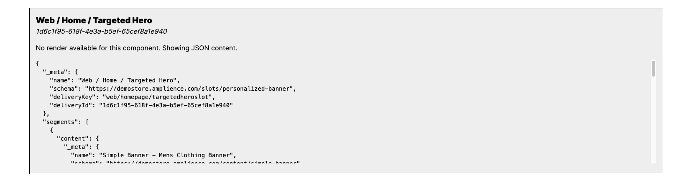

# Amplience Components

## Amplience Components list

| Schema Id                                                    | React Component in `/components/amplience`    | Description                                                                                                              |
| ------------------------------------------------------------ | --------------------------------------------- | ------------------------------------------------------------------------------------------------------------------------ |
| https://demostore.amplience.com/content/curated-product-grid | `./curated-product-grid/curated-product-grid` |  A list of manually curated products from BigCommerce |
| https://demostore.amplience.com/content/dynamic-product-grid | `./dynamic-product-grid/dynamic-product-grid` |  A list of manually dynamic products from BigCommerce |
| https://demostore.amplience.com/content/simple-banner        | `./simple-banner/simple-banner`               |  A basic banner with a dynamic image and a block of text            |
| https://demostore.amplience.com/content/image                | `./image/image`                               | A basic image component                                                                                                  |
| https://demostore.amplience.com/content/text                 | `./image/text`                                | A basic text component using markdown                                                                                    |
| https://demostore.amplience.com/content/blog                 | `./blog/blog`                                 | Blog component including a Blog snippet and a list of content items                                                      |
| https://demostore.amplience.com/content/blog-snippet         | `./blog-snippet/blog-snippet`                 | Blog details component (date, title, etc.)                                                                               |
## Amplience Components rendering

The components above all have a rendering UI. All the other Content Types from Demostore renders as JSON.



### How to add a new component render

You can handle new components by adding their schemas in the `components/amplience/wrapper/amplience-content.tsx` file:

```js
const COMPONENT_MAPPING: ComponentMapType = {
  'https://demostore.amplience.com/content/image': Image,
  'https://demostore.amplience.com/content/text': Text,
  'https://demostore.amplience.com/content/simple-banner': SimpleBanner,
  'https://demostore.amplience.com/slots/flexible': FlexibleSlot,
  'https://demostore.amplience.com/content/curated-product-grid': CuratedProductGrid,
  'https://demostore.amplience.com/content/product-grid': DynamicProductGrid,
  'https://demostore.amplience.com/content/card': Card,
  'https://demostore.amplience.com/content/card-list': CardList,
  'https://demostore.amplience.com/content/rich-text': RichText,
  'https://demostore.amplience.com/content/blog': Blog,
  'https://demostore.amplience.com/content/blog-snippet': BlogSnippet,
};
```
