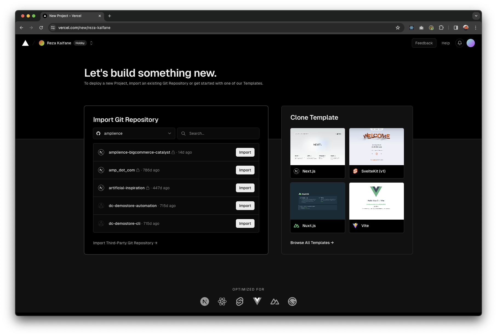
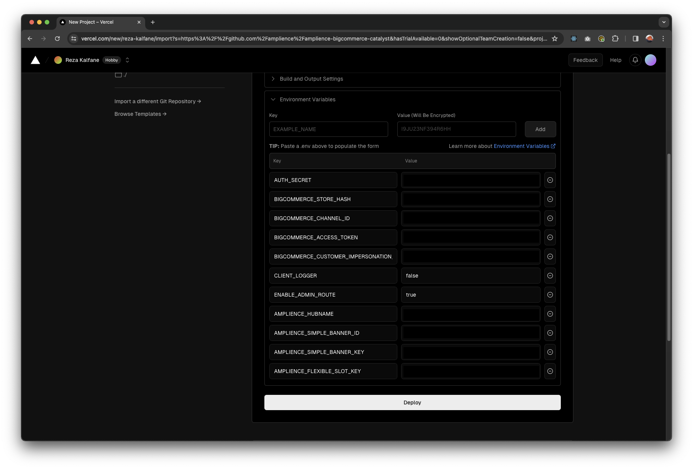

# Deploying to Vercel





```
AUTH_SECRET=XXXX
BIGCOMMERCE_STORE_HASH=XXXX
BIGCOMMERCE_CHANNEL_ID=1234
BIGCOMMERCE_ACCESS_TOKEN=XXXX
BIGCOMMERCE_CUSTOMER_IMPERSONATION_TOKEN=XXXX
CLIENT_LOGGER=false
ENABLE_ADMIN_ROUTE=true
AMPLIENCE_HUBNAME=XXXX
AMPLIENCE_SIMPLE_BANNER_ID=XXXX
AMPLIENCE_SIMPLE_BANNER_KEY=XXXX
AMPLIENCE_HOMEPAGE_DELIVERY_KEY=XXXX
```


